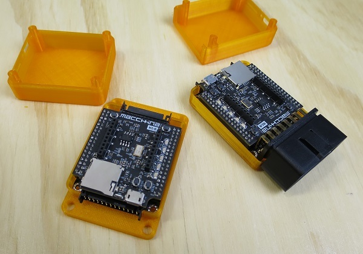

# M2 Enclosures

We've designed a few 3-D printable enclosures that fit M2. Feel free to print, edit, tweak and share what you've made!

This repository contains 4 possible case variations:

* Under-the-hood (UTH) 
* Under-the-hood (UTH) with additional space for XBee modules
* Under-the-dash (UTD)
* Under-the-dash (UTD) with additional space for XBee modules

Any Gcode files are created with Cura for use on an Ultimaker 2 machine. Unless you have the same machine, you'll probably want to re-slice from STL file for your machine.

#### Note: Use the latest M2R3 versions for best fitting enclosures ####

 Our release hardware uses V-scored PCBs, which result in a little more material on the edges of the PCBs. We've updated the enclosure design to address this, so please use the "M2R3" versions.

 We used 4 of [these](https://www.mcmaster.com/#90380a011/=179tb2t) screws in each assembly. We like this translucent plastic so you can see the 5 single-color LEDs through the case. These were printed on an Ultimaker 2 machine.
